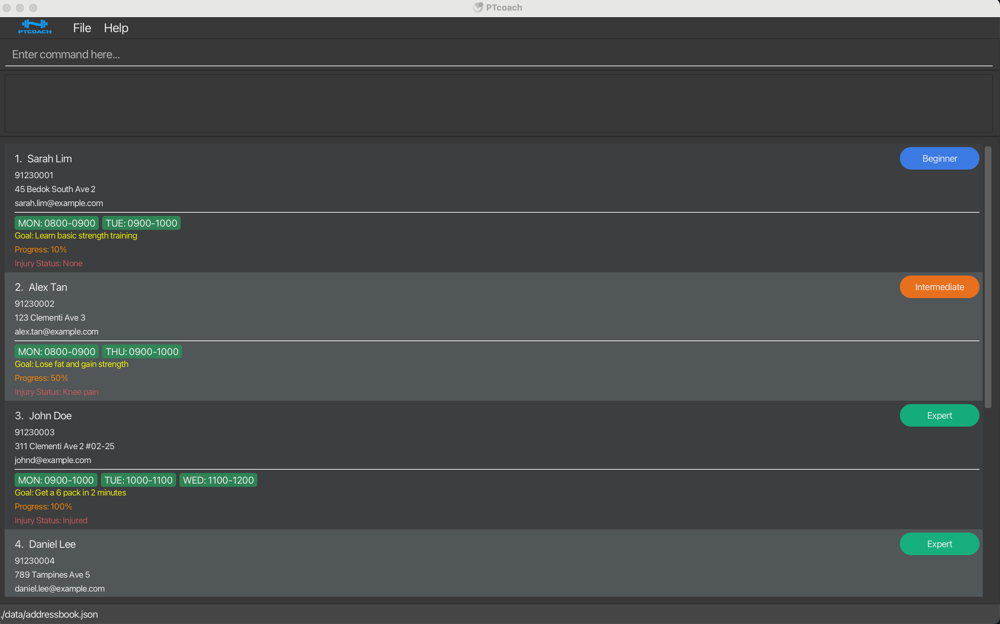

## PTCoach

PTCoach is a desktop application designed for independent personal trainers to manage their client database efficiently.

Each client profile includes:
- Name
- Contact Number
- Address
- Weekly Availability
- Training Goals
- Skill Level*
- Progress Record*
- Injury Status*

\* Optional particulars

The application allows trainers to:
- Add new clients.
- Search for clients by name.
- Delete clients who have stopped training.
- List all clients.
- Read specific client details.
- Automatically save all changes to a local file.

PTCoach is optimized for trainers who prefer a fast Command Line Interface (CLI) while still benefiting from a graphical display of client cards.

* For the detailed documentation of this project, see the **[Address Book Product Website](https://ay2526s2-cs2103-f11-3.github.io/tp/)**

*This project is based on the AddressBook-Level3 project created by the [SE-EDU initiative](https://se-education.org). 
We hereby acknowledge their prior contributions and sincerely hope to take this project one step further.*
