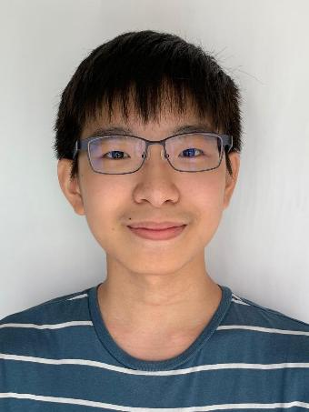
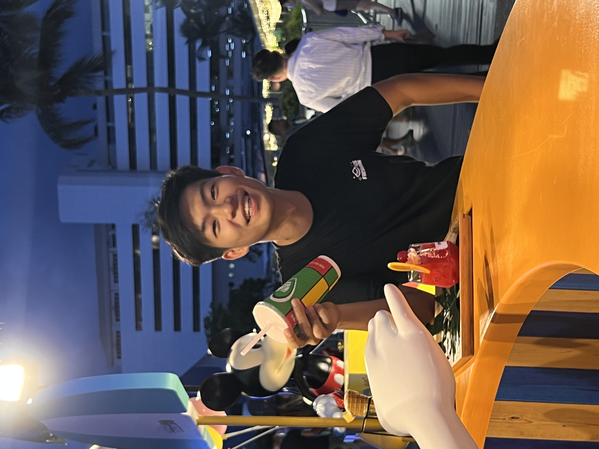
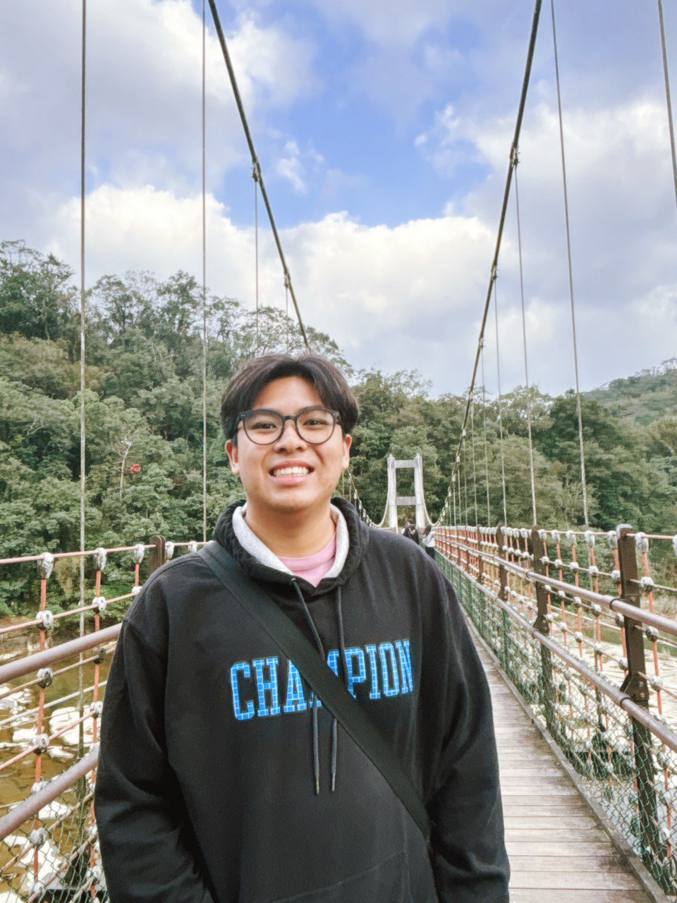

# About Us

We are a team based in the [School of Computing, National University of Singapore](http://www.comp.nus.edu.sg).

You can reach us at the email `seer[at]comp.nus.edu.sg`

## Project team

### Seth Tay

[[github](https://github.com/choppyback)]

* Role: Testing
* Responsibilities: Ensure all code is tested

### Tan Je-Deon

[[github](http://github.com/momentumnn)]
[[portfolio](team/momentumnn.md)]

* Role: Code quality
* Responsibilities: Storage

### Luke Tan

[[github](https://github.com/bingmybongg)]

* Role: Deliverables and deadlines
* Responsibilities: Ensure project deliverables are done on time and in the right format.

### Jolyn Toh

[[github](http://github.com/jolyntmj)]

* Role: Team lead
* Responsibilities: Coordinate project milestones, manage team progress, and ensure smooth collaboration and code quality across the team.

### Lim Zi Yang

[[github](http://github.com/lim-zy)]

* Role: Integration
* Responsibilities: In charge of versioning of the code, integrating various parts of the software to create a whole.
